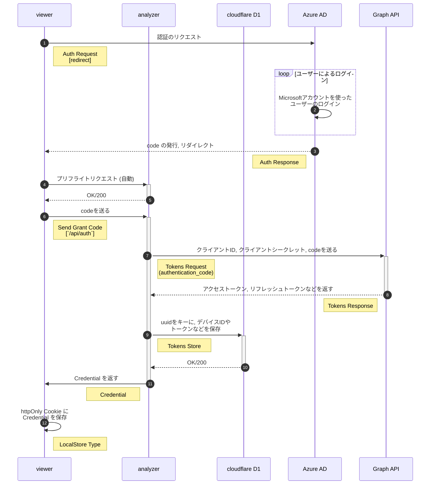

# 要件定義

## 概要

動画の保存と要求の処理と AI での解析をする backend

## フレームワーク

- wrangler
- TypeScript
- Hono

## 機能一覧

- [ ] Credential の発行と管理
  - Azure AD の認可サーバーへ, トークンリクエストを送る
  - アクセストークンとリフレッシュトークンをもらう
  - アクセストークンをもとに, ユーザーの uuid を取得する
  - Cloudflare D1 に uuid をキーに, トークン類などを保存する
  - クライアント用の Credential を発行 & return
- [ ] SharePoint との接続
  - 共有リンクの発行とファイル URL の発行 (blob で返すのもアリ)
  - ファイルアップロード (どうしよう...)
- [ ] API スキーマの生成
  - aspida で作ってはいる...
  - ブランチから index.ts のみを clone して, それをもとに $api と $mock を生成する

## ログインのフロー

