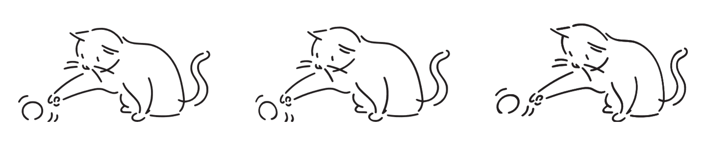
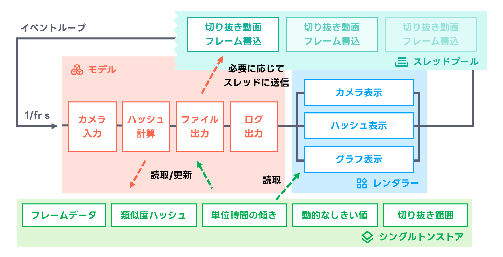
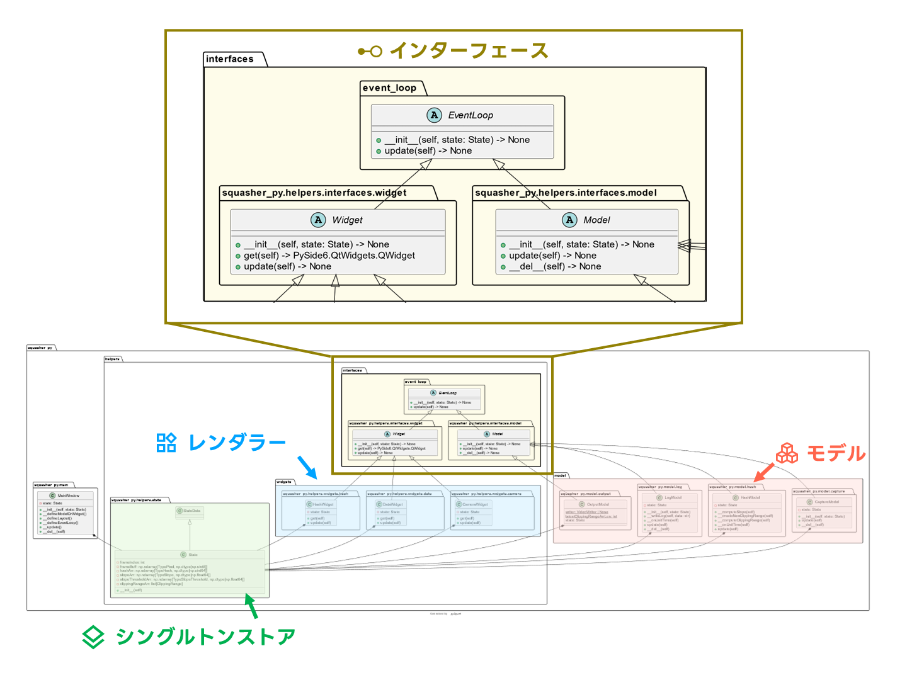
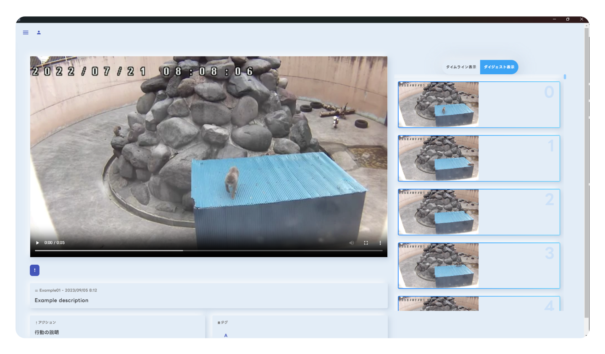
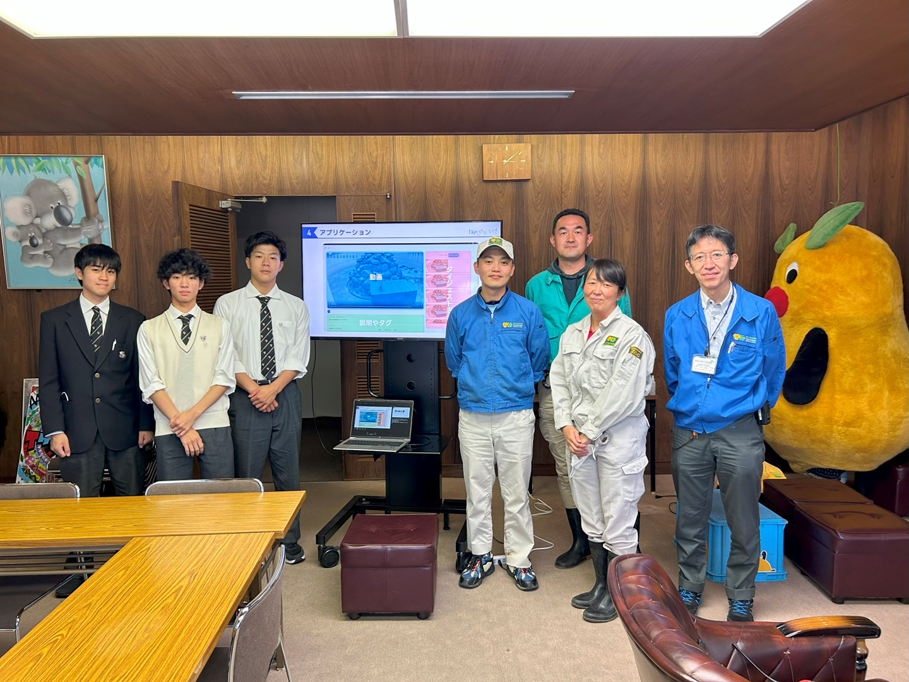

# 論文

## 論文題目名

- AI による動画短縮のための場面抽出分類システム開発

## 本文

### はじめに

情報技術の進歩により、街には多くのカメラが設置されている。しかし、長時間の動画から必要な部分を確認するためには多くの時間を要する。
そこで、必要な場面のみを抽出するシステムがあれば、様々な場面で活用できるのではないかと考えた。また、必要な動画のみを保存することでデータ容量を減らすことができる。
まずは身近な動物の動画を題材とし、動物園や子どもたちの学習に活用できるようなシステムを開発することにした。

### 目的

先行研究では、MPEG 動画から画像を複合せずにマクロブロック (映像の処理単位) から動画のカットを試みている。
しかし、この方法では、MPEG 動画のみにしか対応ができない。私たちは、MPEG 動画だけでなく、カメラ映像からリアルタイムに解析、抽出することによって動画を短縮し、
AI を用いて分類するシステムを開発する。また、誰でも簡単に活用できるよう、Web のアプリケーションとする。

### 研究・活動の内容（概要）

まず、動物の動きを Raspberry Pi のカメラモジュールで撮影し、細分化（ビデオクリップ）する。ビデオクリップは、時間のメタデータとオブジェクトストレージに保存する。
次に、保存されたデータから、ビデオクリップごとにタイル状に並べた画像を生成する。タイル画像を Bard の Image Input API で分析、動物行動に分類し、メタデータに書き込む。
最後に、分類し短縮されたビデオクリップを Web アプリ上に表示する。

### 研究・活動の目的を果たすための調査・活動方法（計画）

#### 動物行動

<!-- @ROTO0504 Word はここに ↓ があったので表とともに入れてあげると良いかも！ -->
<!-- @ROTO0504 Wordファイル: https://wappon28assets.sharepoint.com/sites/lapsquash_teachers/Shared%20Documents/%F0%9F%9A%80%20ait%20AIT%E3%82%B5%E3%82%A4%E3%82%A8%E3%83%B3%E3%82%B9 -->

動物行動の分類には、○○ を使用し、8 つの分類を行うこととした (表 1)。しかし、長時間の動画をそのまま AI で分類を行うことは、データ量が大きく難しい。
そのため、まずは、必要な動きのある場面のみを抽出することにした。
動物行動の変化の境目は、類似度ハッシュを利用して検出した。類似度ハッシュは、画像の特徴を抽出してハッシュ値に変換する関数である。隣り合う画像のハッシュ値の差によって、
画像の変化とできる。

<!-- 

<!-- ↓ Word になかった -->
<!-- リアルタイムで動画を細分化するには、カメラで長時間の動画を撮影する必要がある。しかし、長時間の動画を AI で解析させるのはリソースが限られているため技術的に難しい。そのためまず必要な動きのある場面のみを抽出することにした。ここに 3 枚の行動の画像がある。 1 から 2 枚目の変化は微量だが、 2 から 3 枚目は行動が変化している。
動物行動の変化の境目を検出するため、 今回は 2 つのトリガーをハイブリッド方式で適用した。 --> -->

1 フレームごとに算出された類似度ハッシュの変化を得るために、過去 1 秒の類似度ハッシュ値を最小二乗法の 1 次式で近似し、その傾きを算出した。開発当初は、静的なしきい値で切り抜きを行っていたが、動画によって最適なしきい値が異なるため、過去の傾きから指数移動平均を算出し、動的なしきい値を使用した切り抜きを行う方法に変更した。

図 3 はプログラムの設計を表している。レンダラーとモデルが事前に定義したインターフェースを継承して実装した。

レンダラーとモデルが事前に定義したインターフェースを継承して、切り抜きを行うプログラムを制作した。レンダラー抽象クラスは、
初期化処理と画面描画、1 フレームごとの画面更新するメソッドを持つ。 また、モデル抽象クラスは、初期化処理と 1 フレームごとの更新処理と終了処理を行うメソッドを持つ。
モデルの定義はモデル抽象クラスを継承することで、モデルを拡張機能のように扱うことができるため分離性が高まった。これにより複雑な処理を内容ごとに分離し、パッケージ化できた。
また、イベントループ抽象クラスのコンストラクタにシングルトンストアを注入することで、 継承しているレンダラーとモデル内で簡単にシングルトンストアを利用可能になり、 モデル内で安全にステートの読み書きができるようになった。
これらの設計の工夫によって、後続のモデルにデータを渡しやすくなり、リアルタイム性に優れた OpenCV や PyQtGraph, PySide などの適切なフレームワークを組み合わせて、データの可視化も行った。

#### 動画のタイル化

動画のタイル化・圧縮を行った。 AI のインプット用にビデオクリップから時間ごとのタイル画像を生成する。これにより、 画像入力ができる Bard で解析可能になる。
AI のインプット用にビデオクリップからタイル画像を生成する。これにより、Bard で解析可能になる。解析が終了したタイル画像のメタデータに、ビデオクリップごとの特徴と説明とタグのデータを再格納する。
これらのファイルをオブジェクトストレージである SharePoint に保存する。SharePoint は、Graph API 経由でアクセスが可能である。OAuth 2.0 に準拠するように実装し、ユーザーが Squasher や Viewer にアクセス権限の委任をすることで、ネットワーク上で安全にデータを保存できる。これによりタグ付けされたビデオクリップを Web のアプリケーションで閲覧できるようになった。

Viewer では lapsquash ファイルを読み込み、動画を閲覧可能である。 また、AI が生成した説明やタグを一緒に確認することにより、動物が何をしているのか、また、その行動の意味が分かりやすくなっている。

#### 閲覧 Web アプリケーション (Viewer)

オブジェクトストレージからファイルを読み込み、AI が生成した説明やタグをわかりやすく表示した。Material Design を一部採用し、ニューモフィズムと丸みを持たせたデザインにすることによって操作しやすく、
親しみやすいアプリにした。ニューモフィズムとはフラットデザインに凹凸を加えたデザインのことである。また、インタラクティブな UI にすることでパソコン操作が苦手な人でも直感的な操作が可能になっている。
デバイスの画面サイズに合わせてデザインを最適化しやすいように装飾を減らし、シンプルなデザインを採用した。
配色にも Material Design の Color System を採用することでコンテンツ数が増えた際でも視認性を保つことができた。

### 調査・活動の実施内容と成果

#### 切り抜きアルゴリズムの精度検証

Squasher Core の切り抜きアルゴリズムの精度を検証するために、動画に対して `(始点 [秒], 終点 [秒])` の範囲データを定めた。
人の手で切り抜いた範囲データと Squasher Core が切り抜いた範囲データを比較し、両者の一致率を算出した。許容される誤差として、範囲を 1 秒とした。
その結果、定点カメラにより撮影されたニホンザルの 30 分間の動画（おさるランド＆アニタウン）の精度は 43.5 %、ヒツジの 30 分間の動画（石狩ひつじ牧場）の精度は、54.4 % となった。

#### AI によるタグ付けの精度検証

タグ付けについては、未検証である。その理由は、様々な行動の含まれた動画がなく、検証が難しかったためである。

#### 動物園での意見交換

2023 年 10 月 22 日 (日) 東山動物園にご協力いただき、飼育を担当されている 3 名の方にシステムのプレゼンテーションを行った。
飼育員の方のご意見では、今回使用した分類の方法では曖昧な点が多く、動物行動の定義付けに関する難しさをご指摘いただいた。そのため、汎用的なシステムよりも、
特定の動物に特化した行動分析を行うシステムの方が有用であることがわかった。また、映像に加えて、音声を解析することで、精度を高めることにつながるとのご意見も頂いた。
今回、飼育員の方の活用だけでなく、子どもの学習の活用も目指したが、これに対しても、必要な情報が異なるため、システムを分ける必要があることがわかった。

### 考察・研究・活動についての想定（計画）と結果の比較対照

今後の研究では、解析の精度を高めるため、音声の解析にも力を入れていき、加えて子どもの学習にも活用できるようにアルゴリズムを改善したい。汎用性ではなく、専門性に重きを置いてシステム開発をすることで動物行動の進歩に貢献すると考えている。

### おわりに

本研究では、情報技術の進歩によって増加するカメラ映像から必要な部分を効率的に抽出するシステムを開発するため、
カメラ映像をリアルタイム長時間の動画を短縮し、AI を用いて分類するシステムを開発した。
その結果、人の手による切り抜きデータと Squasher Core の切り抜きアルゴリズムの比較による精度検証では 40–50 % という結果が得られた。
また、AI によるタグ付けの精度は未検証であり、今後の調査が必要である。さらに、東山動物園の飼育員との意見交換会では、特定の動物に特化した行動分析と音声解析の導入の提案があり、システムを適切な大きさで分割する必要があることが分かった。<!-- 考察まとめ -->

### 参考文献

- 表 1

  | タグ | 行動                   |
  | ---- | ---------------------- |
  | $F$  | 採食                   |
  | $S$  | 座る                   |
  | $G$  | 毛づくろい             |
  | $Sl$ | 睡眠                   |
  | $Q$  | 喧嘩                   |
  | $M$  | 動く、跳ぶ、走る、歩く |
  | $P$  | 遊ぶ                   |
  | $C$  | 交尾                   |

*

### 参考文献
