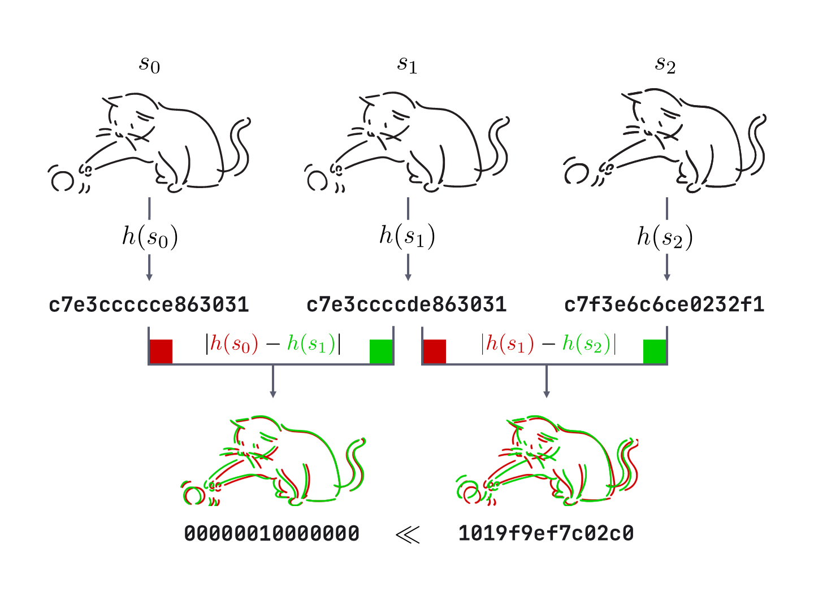
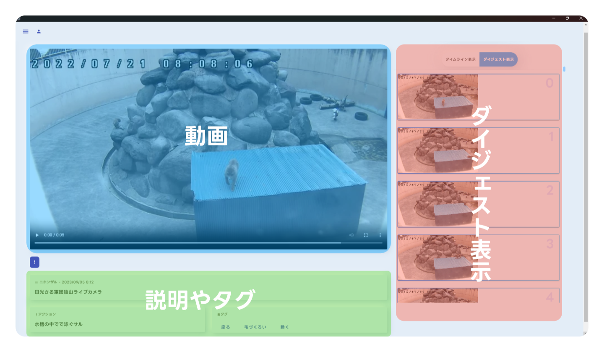
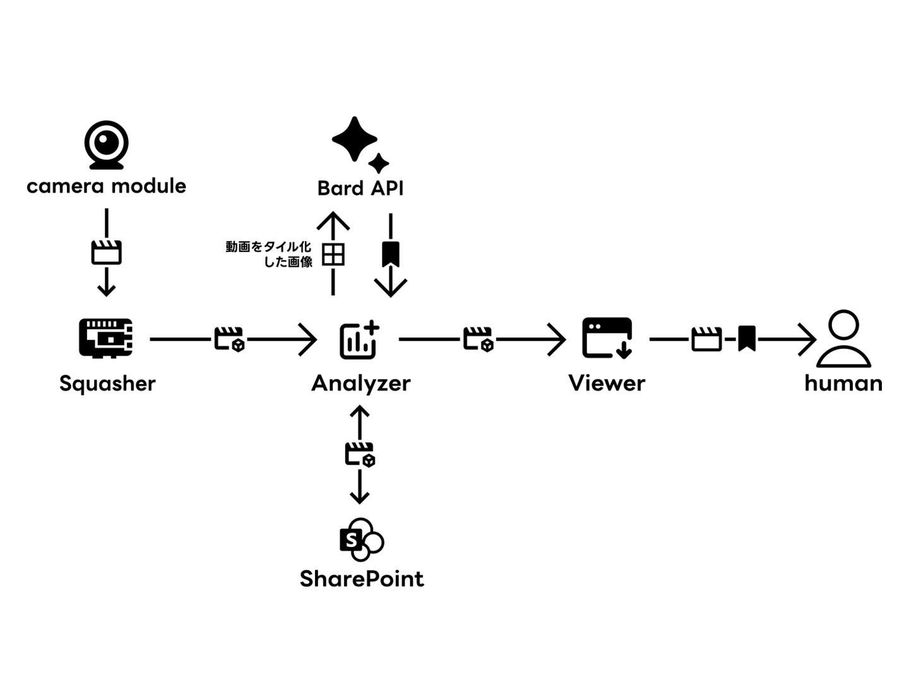

# 論文

## 論文題目名

- AI による動画短縮のための場面抽出分類システム開発

## 本文

### はじめに

映像技術の進歩により、誰でも長時間の動画を撮影できるようになった。しかし、長時間の動画を見直す際に、効率よく重要な場面を探すことは困難である。そこで、重要な場面を自動的に抽出し、予め設定しておいたタグをそれらの動画に付与して Web アプリ上で表示するシステムを開発した。 今回、このシステムは動物の行動を対象として設定した。動物の行動の一部分だけを抽出することで、その行動の出現頻度や種類の分析が容易になり、その動物の行動目的の推察や、行動の意味の理解を深めることにつながる。この研究では、中学生以下の子どもたちが動物園の事前学習するためのツールとして、システムを利用することを想定している。また、このシステムは動物の行動研究に貢献するだけでなく、幅広い分野での動画の分析・分類が可能である。例えば、監視カメラの映像から異常な行動や事件を自動的に検出するなどの利用方法が考えられる。さらに、このシステムは必要な部分だけを動画として保存することから、データ容量を節約でき、比較的安価な機材での構築が可能となっている。

### 目的

本研究では、 Raspberry Pi で対象の動物が動いている場面のみを抽出し、ストレージに保存する。抽出した場面に AI で説明と場面に対応するタグをつける。目標は動物に対する知識を得るアプリとしての確立、動物行動以外の分野での応用を行うことである。

### 研究・活動の内容（概要）

動物園の動物は夜行性も多く、動いていないことが多い。来場者が見たい行動を起こすタイミングは未知であるため、辛抱強く待ったが結局来場者が見たかった行動を見ることができず、動物園を後にしてしまう可能性がある。普段どのような行動をどのぐらいの時間帯にしているのかを動画で確認できれば来場者が見たい行動をしている時間に観に行き、その姿を観察することで動物園を周る効率が上がり、問題を解消できるのではないか。
このような想いから動物園の動物の動画を常時撮影し、動いている部分だけをリアルタイムで抽出し閲覧できる Web アプリを開発した。研究の手順としては、
・ 動物の動きをカメラモジュールで撮影し、それをオブジェクトストレージに保存
・ ビデオクリップを細分化
・動物行動を AI で分析
・ 解析したデータを Web アプリ上に表示
という手順を踏んで動いている。システムは、撮影に Raspberry Pi、動画分析には Bard の Image Input API を利用した。 長時間の動画から自動的に活動シーンだけを切り抜き、AI を用いて分析・分類しアプリとして表示する。
分類した動画を事前に私たちが複数の論文[^1][^2][^3][^4][^5][^6][^7][^8][^9][^10]をもとに設定したタグ(表1)に分類し、抽出した動画が何を写しているのか一目でわかるようになっている。 AI を用いて行動についての説明も追加し、学習にも役立つアプリとした。

| タグ | 行動                   |
| ---- | ---------------------- |
| F    | 採食                   |
| S    | 座る                   |
| G    | 毛づくろい             |
| Sl   | 睡眠                   |
| Q    | 喧嘩                   |
| M    | 動く、跳ぶ、走る、歩く |
| P    | 遊ぶ                   |
| C    | 交尾                   |

表1

### 研究・活動の目的を果たすための調査・活動方法（計画）

リアルタイムで動画を細分化するには、カメラで長時間の動画を撮影する必要がある。しかし、長時間の動画を AI で解析させるのはリソースが限られているため技術的に難しい。そのためまず必要な動きのある場面のみを抽出することにした。ここに 3 枚の行動の画像がある。 1 から 2 枚目の変化は微量だが、 2 から 3 枚目は行動が変化している。
動物行動の変化の境目を検出するため、 今回は 2 つのトリガーをハイブリッド方式で適用した。

1 つ目は類似度ハッシュを利用して検出する方法である。類似度ハッシュは、 画像の特徴を抽出してハッシュ値に変換する関数であり、
同じ画像であれば値は一致し、 違う画像であれば輝度や色、 輪郭の変化によって少しずつ変化する。図 3 の s0、s1 のように画像が変化した場合も検出できる。
隣り合う画像のハッシュの差を取れば、s1、s2 の間に大きな変化があることが確認できる。
しかし、 s1、s2 のように画像の背景のみが変化した場合でもハッシュが変化してしまうため、
2 つ目に最新の物体検出モデル YOLO v8 を使用し、 類似度ハッシュと合わせて観察対象のみの動きを捉えることにした。
しかし、 YOLO v8 では処理が遅すぎて動画の書き出しに影響が出たため、 今回は類似度ハッシュのみをトリガーとした。

図 3 はプログラムの設計を表している。レンダラーとモデルが事前に定義したインターフェースを継承して実装した。

図 4 から、 レンダラーもモデルもイベントループを継承している。
レンダラー抽象クラスは、初期化処理と画面描画、 1 フレームごとの画面更新を行うメソッドを持つ。 またモデル抽象クラスは、 初期化処理と 1 フレームごとの更新処理と終了処理を行うメソッドを持つ。
組み立てやすくするためにモデルの定義はモデル抽象クラスを継承することで、 モデルを拡張機能のように扱うことができるため分離性が高まる。 これによって複雑な処理を内容によって分離でき、 パッケージ化できるようにした。

また、 イベントループ抽象クラスのコンストラクタにシングルトンストアを注入することで、 継承しているレンダラーやモデル内で簡単にシングルトンストアを使用可能になり、 モデル内で安全にステートの読み書きができるようにした。これらの設計の工夫によって、後続のモデルにデータが渡しやすくなり、リアルタイム性に優れた OpenCV や PyQtGraph、 PySide などの適切なフレームワークを組み合わせて表示できた。

動画の切り抜き範囲を決めるアルゴリズムは 1 フレームごとに類似度ハッシュを算出し、 類似度ハッシュの変化を知るために過去 1 秒の類似度ハッシュの値を最小二乗法を用いて 1 次式で近似し、その傾きを求める。
開発当初は静的なしきい値で切り抜きを行っていたが、動画によって最適なしきい値が異なるため、過去の傾きから指数移動平均を取って動的なしきい値を使った切り抜きを行う方法に変更した。

動画のタイル化・圧縮を行った。 AI のインプット用にビデオクリップから時間ごとのタイル画像を生成する。これにより、 画像入力ができる Bard で解析可能になる。

ビデオクリップ、タイル画像、メタデータをひとまとめにしたファイルをオブジェクトストレージである SharePoint に保存する。
SharePoint は、 Graph API という API エンドポイント経由でアクセスが可能である。OAuth 2.0 に準拠するように実装したため、ユーザーが squasher や viewer にアクセス権限の委任をすることで、 離れたところでも安全にデータを保存が可能になっている。

その後、 AI に行動分析をさせ、 Bard の Image Input API を使用し、 タイル画像の特徴と説明、 事前に私たちで決めたタグ付けを行う。
これらの結果は、 先ほどのメタデータに再格納することにより、 Web アプリで閲覧できるようになる。

viewer では lapsquash ファイルを読み込み、動画を閲覧可能である。 また、AI が生成した説明やタグを一緒に確認することにより、動物が何をしているのか、また、その行動の意味が分かりやすくなっている。

viewer のデザインにもこだわった。 Material Design を一部採用し、 ニューモフィズムと丸みを持たせたデザインにすることによって操作しやすく、 親しみやすいアプリにした。 また、インタラクティブな UI にすることでパソコン操作が苦手な人でも直感的な操作が可能になっている。
一画面に squasher で得たデータを実際の動画と同時に確認することで動物がなにをしているのかや行動の意味を確認しやすくなっている。

Material Design を採用することで、デバイスの画面サイズに合わせてデザインを最適化しやすいように装飾を減らし、シンプルなデザインを基本としている。そのため、別のデバイスで使用する時でも操作が容易となっている。それに加え ニューモフィズム デザインを採用することで Material Design のシンプルさに加え UX の向上を図った。ニューモフィズムとはフラットデザインに凹凸を加えたデザインのことである。これを採用することで操作性の向上や他のアプリとの UI での差別化をした。
Web サイトで閲覧するため、画面サイズによってレスポンシブに UI が変化するように設計した。配色には Material Design の Color System を採用することでコンテンツ数が増えた際でも視認性を保つことができた。
実際に動物園の職員の方に画面を見せた際、「見やすい」と、評価を貰った。

次に画面の構成については、動物ごとのダイジェストを確認することが可能である。（図6）
画面右側には動画を時系列に並べ、 選択することでその動画を閲覧できる。 左下側では動画と説明やタグを確認可能である。
一画面に情報が集約されて見ることができるため、他の動画との比較を簡単に行うことが可能である。

以上のように、今回のシステムは大きく分けて 3 つの部分から構成されている。
また、チームで分かりやすく全体図を制作した。(図7)

squasher は Raspberry Pi 上で動いており、 viewer は好きなデバイスで動く。
しかし、 analyzer はエッジ関数として、 世界中のどこからでも実行できるようになっている。
工夫点は、エッジ関数としての analyzer のコードが git submodule として、他の squasher や viewer のコードに組み込まれていることである。 analyzer の API を tRPC で記述することによって、他のどちらからでも安全に呼び出すことができる。

本研究では、長時間撮影された動物の動画を使用し、 AI 技術を用いて分析・分類し、 必要な動画のみを確認できるシステムを開発する。また、 分析結果のダイジェストは、 アプリケーションを介して誰でも閲覧できるようにすることで、 動物園の課題解決にも取り組む。

### 調査・活動の実施内容と成果

研究期間中は、 カメラモジュールからの動画を Raspberry Pi を使用して対象の動物が動いている場面のみを抽出して Web アプリ上に表示した。 動画を Bard の Image Input API で分析し、分析結果と共にストレージへ保存し、 lapsquash アプリで AI が生成した説明の文章とともに表示される。

10 月 22 日に東山動物園の飼育員さんに話を聞いた際、動物行動の定義付けに関する難しさを指摘いただいた。どんな動きをしたら「採食」なのか、餌を探しているときや咀嚼中は「採食」とみなされるのか。「喧嘩」と「遊び」、「睡眠」と「座る」の区別をどのように行うのか。

飼育員さんと来場者は根本の視点が異なるため、それぞれニーズも異なる。飼育員は動画のもっと詳細な情報を必要とし、来場者は一般的な動物の可愛らしい部分を必要としている。
飼育員さん向けの詳細な情報を入手するため、複数のカメラの映像を分析・分類可能にすることや、動画の拡大、縮小機能、小さな動物の切り抜き精度の向上、音声の分析・分類機能、「動いていない場面」を抽出する機能(行動によって声の出し方が異なり、「喧嘩」と「遊び」、「睡眠」と「座る」の区別をするため。)を実装する必要がある。

動物によって必要なソースや、必要なカメラの数が変わる。そのため、1 つのアプリケーションで複数の動物に対応させるのは難しい。用途によって見たい行動や、目的も変わってくるので、目的ごとにアプリを分けて使用者が選択できる方式にすればいい。という意見をいただいた。

動物行動の研究では必ずしも「動いている場面」ばかりを切り抜くわけではなく、見る目的によっては「動いていない場面」を切り抜く必要がある。また、担当者にしか見せない姿もあるが、過去に撮りためた動画から動物を観察することにより、担当者には見せない姿や、担当者が気付かなかったことを発見することができる。

その動物にしか聞こえないような音域や、紫外線、赤外線、動物の体温など人間には感知できない物にも対応した場合、蝶やコウモリなどの超音波や紫外線を感知できる動物や、動物の温度に対する生態の解明に応用が可能になる。

魚類などの常に動いている動物が対象の場合、「動いているか」ではなく、行動の部分のみをピックアップできれば水中の動物や止まらない動物にも利用できる。

1 方向の動画のみで分析するのではなく、上からの映像と横からの映像と 2 方向の映像を使って分析することでより精度が上がる。1 方向のみの動画では起きているのか、寝ているのか区別がつかない場合が多い。

動物の繁殖に関する判断を下す際に、飼育員さんの意見の他に判断材料があることで成功確率が上がると考えている。
飼育員さんの必要なデータは見る目的によって変わり、発情兆候でも動物によって異なる。
行動観察の場合、 1 日の流れの中の何％をその行動に費やしているかの割合を調べることが多く、繁殖と関連づける際は発情兆候が 1 日のうちに起こったかという回数も重要になる。
普段とは異なる行動を抽出することが可能なら、動物の発情の度合いが抽出した動画から分かる。

発情とホルモンの関係性が明確になれば、動物行動を AI に分析させて、今回の発情の成功率を計算し、飼育員さんに通知することで、オスとメスを同じ場所にいさせるかどうかの判断の助けになると考える。

動物の出産後、担当者でもその様子を覗きにいくのは様々なリスクを伴う。親が「ここは子育ての環境にない」と判断し、育児を放棄してしまう可能性がある。育児を放棄された子どもは人工保育になる。人口保育で育てた子どもよりも親が育てた子どもの方が体が丈夫なため、育児放棄をすることがないよう、カメラを使って遠隔で沢山の情報を入手する必要がある。子どもの数、授乳の回数や音などを拾うことができれば、子どもの健康状態や保育状況を遠隔で把握することができる。
「動物の行動」と一口に言っても相当な量があるため、やることは１つに絞った方がいい。
タグ自体は他の動物にも応用可能だが、それぞれの行動の中身は動物の種類によって異なっているため、環境エンリッチメントについての論文を読むことを勧められた。
この研究が実用化レベルであるなら導入したいとおっしゃっていた。

来場者目線なら前日までの 1 週間の平均で、最近はこの時間帯によく動くというデータを作成し、来場者は目的の動物が動いている時間に合わせて行動ができ、動いていない時間は他の動物を見ることができる。動物が行動するタイミングを待たなくても良くなるため、動物園を周る効率が上がる。
また、「今週のおすすめコース」なども作れるとの意見をいただいた。

### 考察・研究・活動についての想定（計画）と結果の比較対照

Squasher Core の切り抜きアルゴリズムの精度を検証するために、動画に対して `(始点 [秒], 終点 [秒])` のような範囲データを定めた。
人の手で切り抜いた範囲データを真の範囲 $R_{tr}$ とし、Squasher Core が切り抜いた範囲データを対象の範囲 $R_{ta}$ とし、真の範囲の要素ごとに、対象の範囲の要素が含まれている割合 $p$ を算出した。

$$
  p = \frac{|R_{tr} \cap R_{ta}|}{|R_{tr}|}
$$

また、始点と終点に対して許容される誤差を始点、終点それぞれ -1 秒、+1 秒とした。
その結果、おさるランド＆アニタウンでのニホンザルの定点カメラの 30 分間の動画[^11] の精度は、43.476 %と、石狩ひつじ牧場でのヒツジの定点カメラの 30 分間の動画[^12] の精度は、54.388 % となった。

抽出部分では切り抜きの範囲が狭すぎることがあった。使用者がこのアプリで動画を閲覧する際、動画が短すぎて動物が何をしているのかが分かりにくいため改善が必要である。
AI のタグ付けや、分析する部分では、青いコンテナの上で歩いている動画を AI に解析させてみたところ、「水槽の中にいるサル」といった抽象的な説明しかできなかった。
今後の課題としては、複数のカメラでも対応できる映像の分析機能。映像の拡大、縮小機能。夜間暗い中での分析や小さな動物の切り抜き精度の向上、音声の分析・分類機能がある。

### おわりに

動物園の職員の方々の話を聞いた際、「画面の動きだけでなく、音の分析・分類ができると動物の観察に役立つ」とアドバイスをいただいた。音声の分析についてはあまり重要性を感じなかったが、動物の鳴き声は種類、性別、年齢、時期などで鳴き方や声色が異なることが分かった。今後の研究では音声の分析、夜間など暗い中での分析、分類に力を入れていく。
現状の課題は切り抜き範囲が細かい AI に動画の説明をさせてみたところ、「水槽の中にいる猿」といった抽象的な文章しか生成できなかったため
今後は、切り抜きのアルゴリズムとプロンプトの改善、タイル画像のフレーム数とそのサイズの調整が必要である。

### 先行研究との違い

行動記録を通じた動物の理解のための動物園動物観察アプリケーションの開発[^13]
この研究では位置情報と温度センサーを用いて動物の行動観察を行っていた。一方、我々の研究では AI で行動の分析をし、行動に対応するタグや行動の説明を付与できる。資金面で見てもカメラを用意するだけであり、人件費もかからないため、より安価に動物行動を観察することができる。

### 参考文献

[^1]: [ニホンザル野生群の日周活動リズム](https://www.jstage.jst.go.jp/article/ase1911/79/2/79_2_128/_pdf)
[^2]: [ニホンザルが毛づくろいをする理由](https://www.osaruland.jp/tips/1820/)
[^3]: [ニホンザルの毛づくろい](https://jinrui.zool.kyoto-u.ac.jp/Arashiyama/guide.html)
[^4]: [東北野生動物保護管理センター](https://www.env.go.jp/nature/choju/effort/effort5/effort5-3b/4_0130_saru.pdf)
[^5]: [ニホンザルってどんな動物？](https://jinrui.zool.kyoto-u.ac.jp/Arashiyama/whatisJmacaque.html)
[^6]: [ニホンザルの分布](https://jinrui.zool.kyoto-u.ac.jp/FuscataHome/bunpu.html#:~:text=%E6%97%A5%E6%9C%AC%E3%81%AB%E7%94%9F%E6%81%AF%E3%81%99%E3%82%8B%E3%82%B5%E3%83%AB,%E5%BA%83%E3%81%8F%E5%88%86%E5%B8%83%E3%81%97%E3%81%A6%E3%81%84%E3%81%BE%E3%81%99%E3%80%82)
[^7]: [ニホンザルの一日](https://jigokudani-yaenkoen.co.jp/contents/detail?id=117)
[^8]: [絶滅危惧種リスト](https://endangered-species.biz/archives/2457)
[^9]: [京都大学学術情報リポジトリ](https://repository.kulib.kyoto-u.ac.jp/dspace/bitstream/2433/148029/1/100_145.pdf)
[^10]: [ニホンザルの生態と生息環境について](https://www.pref.shiga.lg.jp/file/attachment/1010347.pdf)
[^11]: [日光さる軍団猿山ライブカメラ](https://www.youtube.com/live/IjMWzpyCNZM?feature=share)
[^12]: [石狩ひつじ牧場ライブカメラ](https://youtu.be/8gHdcDgNnJg)
[^13]: [情報処理学会](https://ipsjixsq.nii.ac.jp/ej/?action=repository_uri&item_id=107178&file_id=1&file_no=1)
