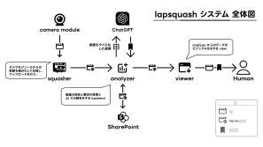

# 研究計画書

## テーマ

**AI による動画短縮のための場面抽出分類システム開発**  
～カメラモジュールと AI を用いた動物行動のモニタリングとダイジェスト化～

## 研究期間

2023/04/01 - 2023/12/16

## 研究の背景・目的

動画が安価で手軽に撮影出来るようになったことから、動物園などの研究機関をはじめ、留守番中のペットなど身近なところでも、常時撮影が行われています。しかしながら、長時間撮影された動画を全て見ることは困難です。そこで、本研究では長時間の動画を分析・分類をし、分析結果のダイジェスト化を目的とします。

## 研究の手法・方法論

本研究では、長時間撮影された動物の動画を使用し、AI 技術を用いて分析・分類し、必要な動画のみを確認できるシステムを開発します。また、分析結果のダイジェストは、アプリケーションを介して誰でも閲覧できるようにすることで、動物園の課題解決にも取り組みます。

## 研究の予定・進行状況

研究期間中は、カメラモジュールからの動画を細分化して圧縮し、アップロードを行い、動画を GPT-4 の API で分析します。分析結果と共にオブジェクトストレージへ保存し、動画と分析結果をアプリケーションで閲覧できるようにします。研究期間後半には、研究成果の発表会を開催し、研究成果を広く社会に伝える予定です。

## 研究成果の想定・期待

本研究の成果により、動物の行動分析が容易になることで、新たな生態傾向や、多種多様な動物の共通点を発見するなどの効果が期待されます。動物の関係性や行動が理解できれば、動物園の発展にもつながる成果が期待されます。

## 全体図

## 参考文献

吉田 信明、田中 正之、和田 晴太郎 行動記録を通じた動物の理解のための動物園動物観察
アプリケーションケーションの開発 (情報処理学会)
